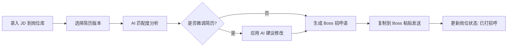
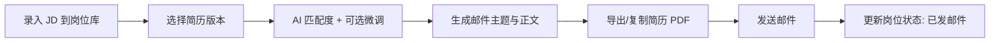

# Job Application Assistant — 产品需求文档

> 版本：v0.1 | 更新：2026-06-20  
> 目标：秋招 AI 产品岗投递助手，支持 Boss 直聘 + 邮箱投递

---

## 1. 背景与目标

### 1.1 背景

秋招投递 AI 产品岗时，同一份简历难以适配不同 JD；Boss 招呼语与邮箱正文需要针对岗位重写，重复劳动多、质量不稳定。

### 1.2 产品目标

| 目标 | 说明 |
|------|------|
| **提效** | 粘贴 JD → 一键生成定制简历片段、Boss 招呼语、邮箱话术 |
| **沉淀** | 经历素材库 + 多版本简历，避免每次从零写 |
| **可控** | 数据与 API Key 仅存本地 `data/`，不上传云端 |
| **聚焦** | 仅服务 AI 产品岗秋招场景，不做通用求职平台 |

### 1.3 非目标（Out of Scope）

- 自动在 Boss / 邮箱平台提交（仅生成文案，人工复制粘贴）
- 多用户、账号体系、云端同步
- 非 AI 产品岗的通用求职功能

---

## 2. 用户画像

- **角色**：应届生 / 实习生，目标岗位为 AI 产品经理、AI 产品运营等
- **投递渠道**：Boss 直聘（主动打招呼）、企业邮箱（简历 + 正文）
- **技术水平**：能本地启动 Web 应用、配置 DeepSeek API Key

---

## 3. 核心功能

### 3.1 经历素材库

| 字段 | 说明 |
|------|------|
| 标题 | 如「XX 实习 - 需求分析」 |
| 类别 | 实习 / 项目 / 竞赛 / 其他 |
| 原始描述 | 完整经历正文（STAR 等） |
| 关键词标签 | 如 `LLM`、`A/B测试`、`用户调研` |
| 可复用要点 | AI 提炼的 bullet 要点列表 |

**操作**：增删改查、按标签筛选、导出为 Markdown。

### 3.2 多版本简历

- 基于「主简历」派生多个版本（如 `ai-pm-general`、`llm-focus`）
- 每版包含：个人信息区、教育、经历块（引用素材库 ID）、技能、自我评价
- 支持 Markdown 编辑与预览

### 3.3 AI 简历微调（DeepSeek）

**输入**：目标 JD 全文 + 选定简历版本  
**输出**：

1. 匹配度评分（0–100）及简要理由
2. **结构化评估块**（A–F）：岗位要求、简历匹配、职级、差距、定制方向、面试角度
3. **recommendation**：`apply`（≥75）/ `consider`（60–74）/ `skip`（<60）
4. JD 关键词 ↔ 简历覆盖对照表
5. 建议修改的简历段落（diff 风格或替换块）
6. 缺失能力补写建议（是否可从素材库拼装）

**约束**：不得虚构经历；仅基于素材库与现有简历改写。

### 3.4 岗位库

| 字段 | 说明 |
|------|------|
| 公司 / 岗位 | 文本 |
| JD 原文 | 粘贴保存 |
| 来源 | `boss` / `email` / `other` |
| 状态 | `待投递` / `已打招呼` / `已发邮件` / `已回复` / `放弃` |
| 关联简历版本 | 简历 ID |
| 备注 | 自由文本 |
| 创建 / 更新时间 | ISO 8601 |

**操作**：列表筛选、状态流转、关联某次 AI 生成记录。

### 3.5 Boss 招呼语生成

**输入**：JD + 简历版本（或微调后简历摘要）  
**输出**（约 80–150 字）：

- 开场：岗位 + 公司
- 亮点：1–2 条与 JD 最相关的经历
- 结尾：表达意向 + 可附作品集 / 简历说明

支持一键复制；可保存到岗位记录。

### 3.6 邮箱投递话术生成

**输入**：JD + 简历版本 + 可选收件人称呼  
**输出**：

1. **邮件主题**（≤ 50 字）
2. **正文**（200–400 字）：自我介绍、匹配点、附件说明、联系方式
3. **附件清单建议**（简历 PDF 命名规范等）

支持 Markdown / 纯文本切换与一键复制。

---

## 4. 用户流程

### 4.1 Boss 投递流程



### 4.2 邮箱投递流程



---

## 5. 技术方案

> 运行时架构详见 [ARCHITECTURE.md](./ARCHITECTURE.md)；User/System 数据边界见 [DATA_CONTRACT.md](./DATA_CONTRACT.md)。

### 5.1 架构

| 层级 | 选型 | 说明 |
|------|------|------|
| 前端 | HTML + CSS + 原生 JS | 本地单页，无构建依赖，易维护 |
| 后端 | Python 3.11+ / FastAPI | REST API、静态资源托管、DeepSeek 代理 |
| AI | DeepSeek API (`deepseek-chat`) | 简历分析、文案生成 |
| 存储 | `data/` 目录 JSON 文件 | 无数据库，便于备份与 Git 忽略 |

### 5.2 目录结构

```
job-application-assistant/
├── docs/
│   ├── PRD.md
│   ├── ARCHITECTURE.md
│   └── DATA_CONTRACT.md
├── config/
│   └── profile.example.yml
├── templates/
│   ├── states.yml
│   └── prompts/               # Markdown Prompt 规格
├── data/                      # User Layer（gitignore）
├── reports/                   # AI 报告（gitignore）
├── jds/ output/               # JD 存档 / 导出
├── examples/                  # 样例文件
├── src/
│   ├── backend/
│   └── frontend/
├── requirements.txt
└── README.md
```

### 5.3 数据模型（JSON Schema 概要）

**experiences.json**

```json
{
  "items": [
    {
      "id": "uuid",
      "title": "string",
      "category": "internship|project|competition|other",
      "content": "string",
      "tags": ["string"],
      "bullets": ["string"],
      "created_at": "ISO8601",
      "updated_at": "ISO8601"
    }
  ]
}
```

**resumes.json** — 版本列表，每版含 `blocks` 引用 `experience_id`  
**jobs.json** — 岗位库记录  
**generations.json** — `{ job_id, type, prompt_hash, input, output, created_at }`  
**settings.json** — `{ deepseek_api_key, model, default_resume_id }`

### 5.4 API 端点（v0.1）

| 方法 | 路径 | 说明 |
|------|------|------|
| GET | `/api/health` | 健康检查 |
| CRUD | `/api/experiences` | 经历素材 |
| CRUD | `/api/resumes` | 简历版本 |
| CRUD | `/api/jobs` | 岗位库 |
| POST | `/api/ai/match` | JD 匹配度分析 |
| POST | `/api/ai/tune-resume` | 简历微调建议 |
| POST | `/api/ai/boss-greeting` | Boss 招呼语 |
| POST | `/api/ai/email-draft` | 邮箱话术 |
| POST | `/api/ai/auto-pipeline` | 一键流水线（match → tune → boss/email） |
| GET | `/api/doctor` | 环境自检 |
| GET | `/api/states` | 岗位状态与匹配阈值 |
| GET/PUT | `/api/settings` | 本地设置（Key 脱敏返回） |

### 5.5 DeepSeek 集成

- Base URL：`https://api.deepseek.com`
- 模型：`deepseek-chat`
- API Key 优先读 `data/settings.json`，其次环境变量 `DEEPSEEK_API_KEY`
- 所有 Prompt 模板置于 `templates/prompts/*.md`（Markdown 规格，Python 仅 load + format）
- 请求失败：友好错误 + 不重试超过 2 次

### 5.6 隐私与安全

- `data/` 下除 `.gitkeep` 外全部 `.gitignore`
- 日志不打印 API Key 与简历全文
- 仅绑定 `127.0.0.1`，不对外网暴露

---

## 6. 页面结构（前端）

| 页面 / Tab | 功能 |
|------------|------|
| 首页 / 仪表盘 | 待投递岗位数、最近生成记录、快捷入口 |
| 经历素材 | 列表 + 编辑表单 |
| 简历 | 版本切换、Markdown 编辑、预览 |
| 岗位库 | JD 录入、状态、关联操作 |
| AI 工作台 | 选岗位 → 匹配 / 微调 / Boss / 邮箱 四合一 |
| 设置 | API Key、默认简历、数据目录说明 |

---

## 7. 里程碑

| 阶段 | 内容 | 验收标准 |
|------|------|----------|
| **M0 初始化** | PRD、目录、骨架、README | 能 `pip install` + `uvicorn` 启动，首页可访问 |
| **M1 契约与流水线** | DATA_CONTRACT、ARCHITECTURE、Prompt 外置、Auto-Pipeline、doctor | doctor 通过；一键流水线可生成报告 |
| **M2 AI 能力** | 匹配度、Boss、邮箱三类生成 | 粘贴真实 JD 可出可用文案 |
| **M3 简历微调** | 分段建议 + 素材库引用 | 输出不虚构、可手动采纳 |
| **M4 体验打磨** | 复制按钮、状态流转、错误提示 | 完整走通 Boss + 邮箱各一次 |

---

## 8. 成功指标

- 单岗位从录入 JD 到生成 Boss 招呼语 **< 3 分钟**
- 生成的招呼语 / 邮件正文 **无需大改即可发送** 的比例 ≥ 70%（主观自评）
- 零敏感数据泄露至 Git 仓库

---

## 9. 附录：Prompt 设计原则

1. ** grounded **：明确列出素材库与简历原文，禁止编造公司与项目
2. **JD 对齐**：先抽取 JD 硬性 / 软性要求，再逐条映射
3. **渠道差异**：Boss 短、口语化；邮箱正式、结构完整
4. **AI 产品岗语境**：突出 LLM 应用、数据驱动、用户研究、跨团队协作等维度
